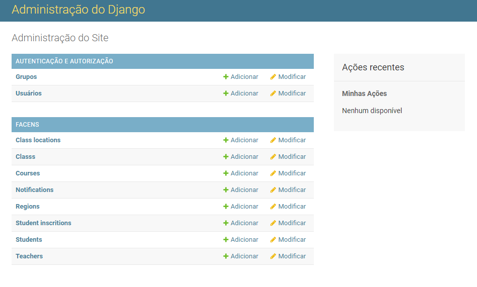
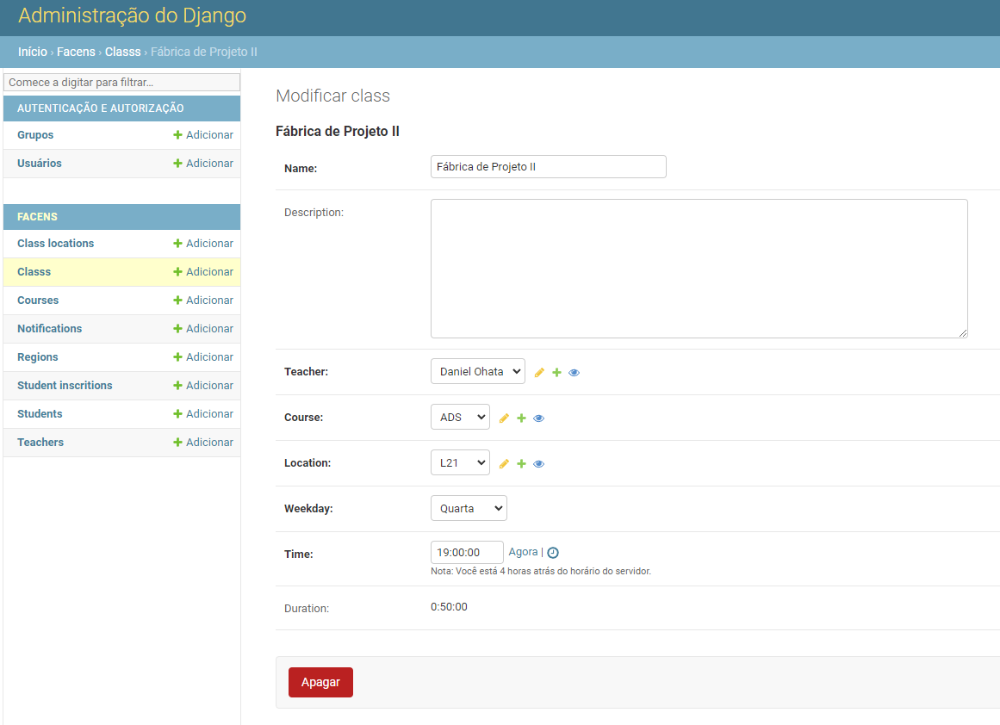
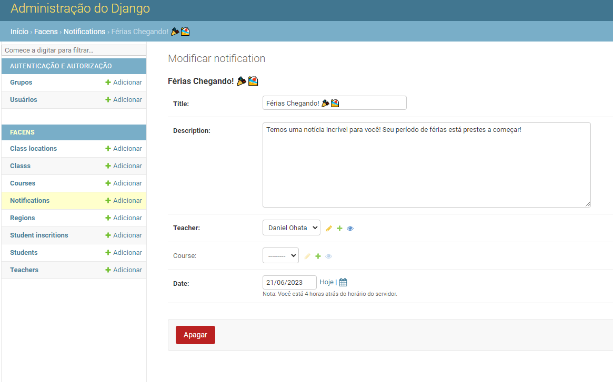
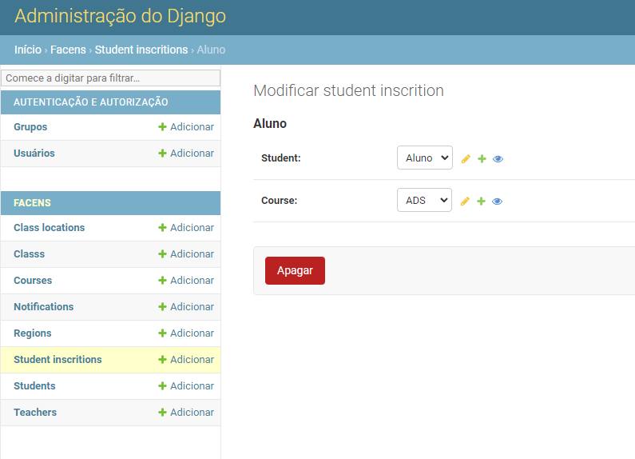
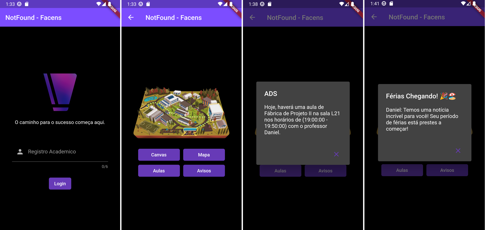

# 🎓 NotFound Server

## 📘 Sobre o Projeto

O Projeto NotFound Server é um projeto desenvolvido com Python e Django que tem como objetivo gerenciar dados acadêmicos de alunos de faculdades. Este servidor foi projetado para ser uma solução robusta e flexível para a gestão de dados acadêmicos, proporcionando uma interface amigável e intuitiva.



## 🔧 Como o Servidor foi Construído

O servidor foi construído usando Python, uma linguagem de programação de alto nível, juntamente com o Django, um framework de alto nível em Python que incentiva o desenvolvimento rápido e o design limpo e pragmático. O Django foi escolhido por sua arquitetura baseada em modelo-visão-controlador (MVC), que permite a separação clara entre a lógica de negócios e a interface do usuário.

## 💻 Tecnologias Utilizadas
- 🐍 Python: Linguagem de programação empregada na implementação do servidor.
- 🚀 Django: Framework Python utilizado para estruturar o servidor.

## 📋 Requisitos para Utilizar o Sistema

Para rodar o NotFound Server na sua máquina, você precisa ter os seguintes requisitos instalados:

- 🐍 Python (versão 3.7 ou superior)

Além disso, é necessário que você tenha um conhecimento básico de como usar a linha de comando no seu sistema operacional.

## 🚀 Como Usar

1. Primeiramente, clone o repositório usando o seguinte comando no terminal:

    ```sh
    git clone https://github.com/FacensProjects/Facens-NotFound-Server.git
    ```

2. Em seguida, entre na pasta do projeto com o comando:

    ```sh
    cd Facens-NotFound-Server/server
    ```

3. Agora, instale as dependências do projeto usando o pip, o gerenciador de pacotes do Python:

    ```sh
    pip install -r requirements.txt
    ```

4. Depois de instalar as dependências, você precisa configurar o banco de dados. O Django facilita essa tarefa com o comando makemigrations:

    ```sh
    python manage.py makemigrations
    ```

5. Aplique as migrations com o comando:

    ```sh
    python manage.py migrate
    ```

6. Agora, crie um superusuário para ter acesso ao painel administrativo:

    ```sh
    python manage.py createsuperuser
    ```

7. Finalmente, inicie o servidor com o comando:

    ```sh
    python manage.py runserver
    ```

8. Agora você pode acessar e gerenciar o servidor com o usuário criado localmente no endereço: [http://127.0.0.1:8000/admin](http://127.0.0.1:8000/admin)

    
    
    

## 📱 Aplicativo Facens-NotFound

O NotFound Server foi desenvolvido como parte integrante do aplicativo externo [Facens-NotFound-App](https://github.com/FacensProjects/Facens-NotFound-App/). Esses dois projetos trabalham em conjunto para fornecer uma solução completa de gerenciamento de dados acadêmicos.



## 👥 Desenvolvedores

- [WhitePoodleMoth](https://github.com/WhitePoodleMoth)

## 📄 Licença

O NotFound Server é licenciado sob a Licença MIT. Veja o arquivo [LICENSE](https://github.com/FacensProjects/Facens-NotFound-Server/blob/main/LICENSE) para mais detalhes.
